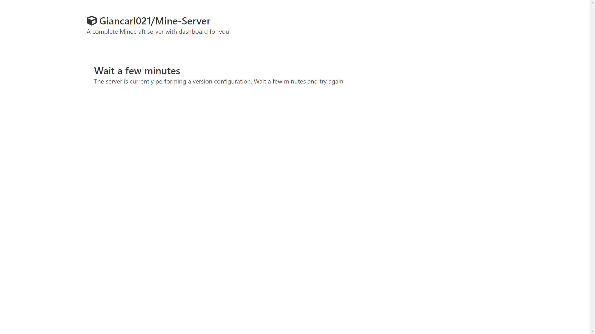
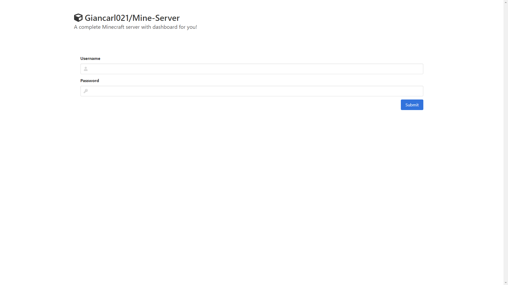
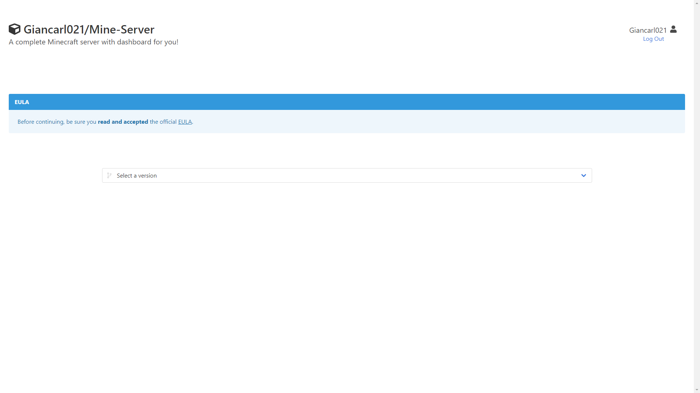
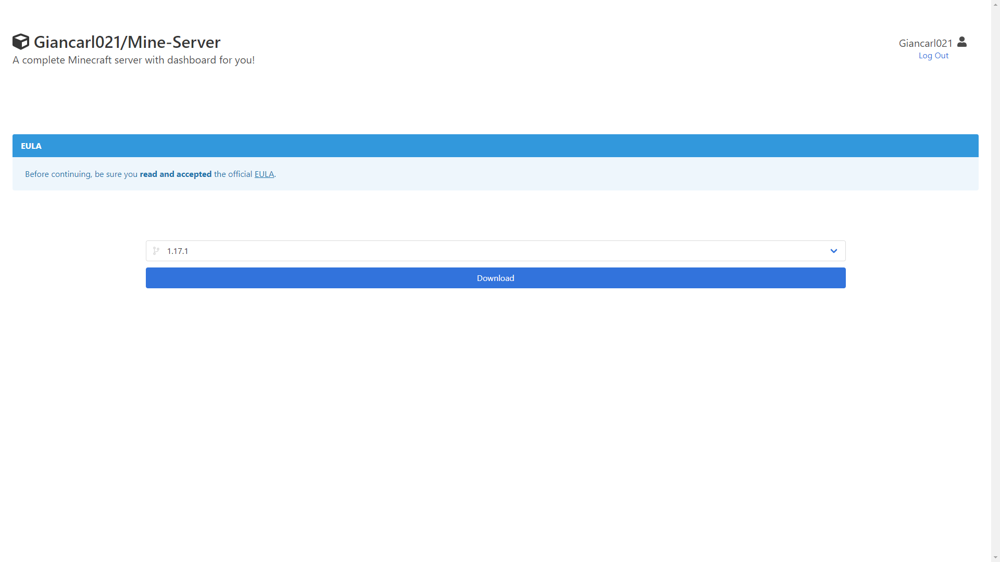
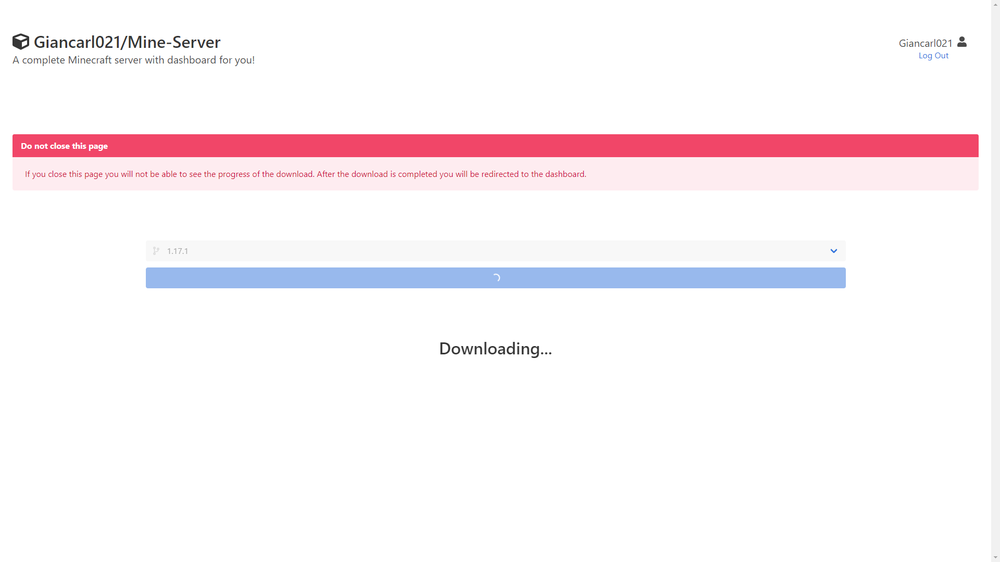
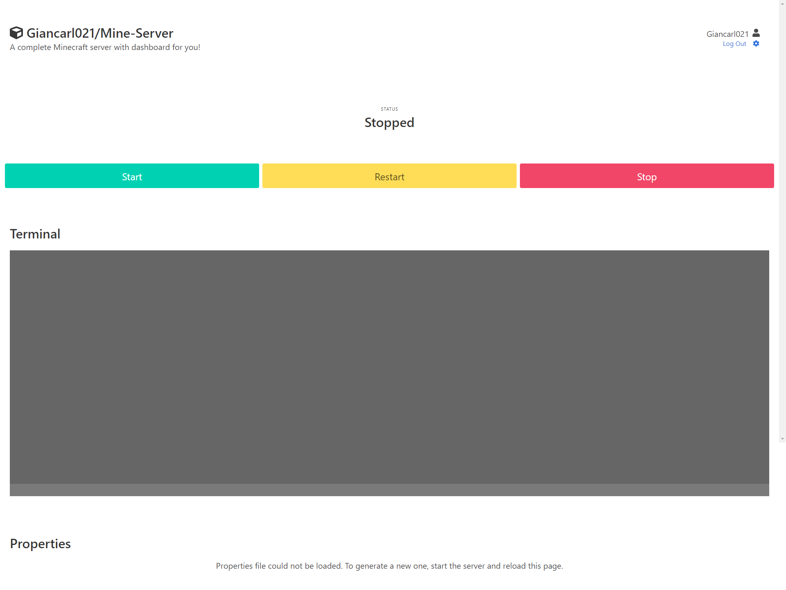
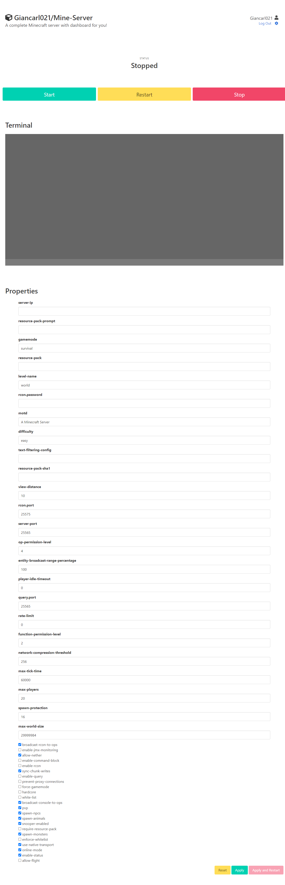
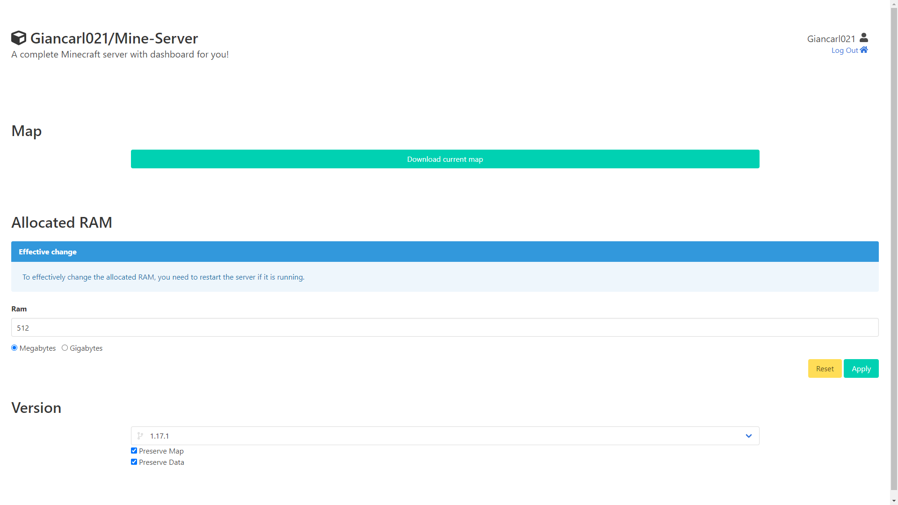

# Minecon

Mine(craft)Con(tainerized) its a dashboard for Minecraft servers
## Installation

Docker is required for this application.
### Command

```bash
docker run -p 80:80 -p 25565:25565 -e "EULA=TRUE" -e "ADMIN_USERNAME=admin" -e "ADMIN_PASSWORD=changeme" -v "path/to/volume:/usr/app/data" giancarl021/minecon
```

### Flags

* ``-p 80:80``: The Dashboard port
* ``-p 25565:25565``: The Minecraft Server port
* ``-e EULA=TRUE``: Confirmation you read the EULA (Required)
* ``-e ADMIN_USERNAME=admin``: The admin username
* ``-e ADMIN_PASSWORD=changeme``: The admin password

## First configuration

After running the container, it should be possible to access the dashboard on the port `80` or another specified in the `PORT` Environment Variable.

Because the database do not have information about the versions, the application will start to update it. This process should take between 5-15 minutes to complete. While the update is running, all the dashboard routes will show this page:



### Accessing the dashboard

After the database is updated, accessing the dashboard will redirect to the login page, requesting the credentials set in the `ADMIN_USERNAME` and `ADMIN_PASSWORD` Environment Variables:


### Selecting a version

Once logged in, the next page will be the version selection page:



After selecting the version the Download button will appear:



Clicking on the button will start the download of the version from the official Mojang servers. After awhile the page will be redirected to the main dashboard.


## Dashboard

The main dashboard is where the administrator manage the server:



### Start/Stop/Restart the server

The state of the server can be changed by clicking on the tree first buttons on the top of the page.

The current status is displayed above the buttons.
### Send a command to server

With the server properly initialized, the terminal will activate, allowing the administrator to execute commands directly into the server, such as `op <player>` or `time set 0`.

### Change properties of the server
> **Important:** To change the properties the server must be initialized at least one time.

The properties page will vary depending on the version chosen. The image below shows an exemple for the version 1.17:



After changing the desired properties, clicking on the `Apply` button will save the file, but not apply the changes on the current session. Clicking `Apply and Restart` will save the file and restart the server, applying the new configuration.

## Configurations

The configuration page is where the administrator manage more in-depth resources of the server:


### Downloading the server map

Clicking on the button `Download current map` will download the map used in the server.

### Changing the maximum RAM usage

By writing in the input the number of Megabytes or Gigabytes (depending on the selector above the input) and clicking `Apply` will change the configuration of the server. To apply the changes the server must be restarted.

### Changing the version

The last option on the configuration page is the version. Here it is possible to select a new version for the server, choosing between saving or deleting current data.

> **Important:** Be aware that the application does not checks for compatibility between the versions, use the `Preserve Map` and `Preserve Data` at your own risk

After selecting the new version, the `Download` button will appear. Clicking on it will download and apply the new version of the server.

## Azure SQL as Version database

For reasons of compatibility, the project allows the use of an Azure SQL instance as a Version database.
### Environment Variables

```env
USE_AZURE_SQL=<True|False>
SQL_USERNAME="<username>"
SQL_PASSWORD="<password>"
SQL_SERVER="<server>"
SQL_DATABASE="<database>"
```